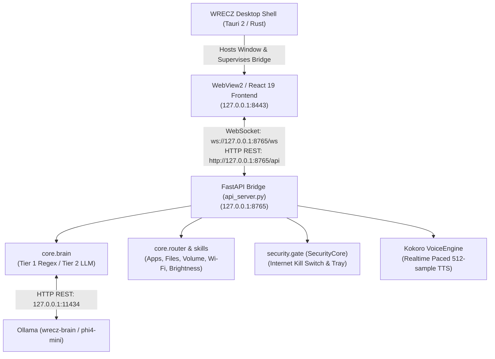

# WRECZ — Local AI PC Assistant

[](https://microsoft.com)
[](https://python.org)
[](https://tauri.app)
[](https://github.com/hexgrad/kokoro)
[-orange.svg)](https://ollama.com)
[](#license)

**WRECZ** is a private, local-first Windows AI assistant. Speech generation, intent classification, and operating system control all run directly on your hardware — nothing is sent to hosted services or cloud telemetry.

---

## 🏗️ Architecture

WRECZ consists of a Python FastAPI bridge process, a React 19 / TypeScript UI wrapped in a native Tauri 2 desktop shell, and a local Ollama model.



---

## ✨ Key Features

* **Two-Tier Intent Routing:**
  * **Tier 1 (Deterministic Rules):** Instant regex-based routing (~0.16 ms) for system commands (volume, brightness, Wi-Fi, Bluetooth, web search, app launching). Works even when Ollama is offline.
  * **Tier 2 (Local LLM):** Leverages `phi4-mini` via Ollama for conversational queries, context reasoning, and unstructured requests (~3.4 s).
* **Strict Security Invariants:**
  * **Default Offline:** Internet access is strictly **OFF** at the start of every session.
  * **Action Safety Gates:** Destructive actions (closing apps, modifying files) and web operations trigger interactive confirmation dialogs with fail-closed defaults.
  * **Hardware Tray Indicator:** A Windows notification area tray icon provides an immediate visual status (Red = blocked, Green = online) and a hardware emergency kill switch.
* **Synchronized Audio Visualizer:**
  * Kokoro TTS writes audio in 512-sample slices paced directly by the sound device.
  * Slices are streamed over WebSockets to an HTML5 Canvas visualizer, keeping the center-line waveform precisely aligned with speech without React re-renders.
* **Native Desktop Experience:**
  * Frameless Tauri 2 shell with custom window controls and automatic Python bridge process supervision.

---

## 📁 Repository Structure

```
.
├── Modelfile                  # Ollama model definition (phi4-mini, GPU offloaded)
├── .gitignore                 # Excludes ~6.4 GB of targets, venvs, and private logs
├── README.md                  # Project documentation
│
├── wrecz/                     # Python Backend
│   ├── api_server.py          # FastAPI bridge (HTTP + WebSocket server)
│   ├── main.py                # Standalone CLI entrypoint
│   ├── run_all.py             # Browser-mode launcher (starts backend + frontend)
│   ├── requirements.txt       # Python dependencies
│   ├── core/                  # Brain, router, executor, and settings
│   ├── security/              # SecurityCore, safety policy, tray, and verification
│   ├── skills/                # Windows OS automation skills (volume, wifi, apps, files)
│   └── voice/                 # Kokoro TTS engine and audio streaming
│
└── wrecz-frontend/            # Frontend (React + Tauri)
    ├── package.json           # Node scripts and dependencies
    ├── vite.config.ts         # Vite configuration (port 8443)
    ├── src/                   # React components, visualizer canvas, and hooks
    └── src-tauri/             # Rust desktop shell (Cargo.toml, lib.rs, tauri.conf.json)
```

---

## 📋 Prerequisites

Ensure the following tools are installed on your Windows machine:

1. **Python 3.12+**: [python.org](https://www.python.org/downloads/) *(Ensure "Add Python to PATH" is checked during install)*
2. **Node.js 18+ & npm**: [nodejs.org](https://nodejs.org/)
3. **Ollama**: [ollama.com](https://ollama.com/)
4. **For Desktop App (Tauri 2)**:
   * **Rust**: `winget install Rustlang.Rustup` then `rustup default stable-x86_64-pc-windows-msvc`
   * **C++ Build Tools**: Visual Studio Build Tools with the *Desktop development with C++* workload.
   * **WebView2**: Standard on Windows 10/11.

---

## 🚀 Quick Start

### Option 1: One-Click Automated Installer (Recommended)
Simply **double-click `setup_prerequisites.cmd`** in the repository root.
It will automatically:
* Check and install **Python 3.12**, **Node.js LTS**, and **Ollama**.
* Check and install **Rust** and **MSVC C++ Build Tools** for Tauri.
* Download `phi4-mini` and build the local `wrecz-brain` model.
* Create the backend `.venv`, install PyTorch / Kokoro requirements, and run `npm install`.
* Present a launch menu to immediately run the app!

---

### Option 2: Manual Step-by-Step Setup

#### 1. Configure the Ollama Model
In the root directory, create the local `wrecz-brain` model:
```powershell
ollama create wrecz-brain -f Modelfile
```

### 2. Set Up the Backend
```powershell
cd wrecz
py -3.12 -m venv .venv
.venv\Scripts\activate
pip install -r requirements.txt
```

### 3. Set Up the Frontend
```powershell
cd ..\wrecz-frontend
npm install
```

---

## 💻 Running WRECZ

Choose your preferred launch mode:

### Option A: Native Desktop App (Recommended)
Launches the frameless native desktop window and automatically manages the backend bridge process:
```powershell
cd wrecz-frontend
npm run desktop
```

### Option B: Browser Mode (Dual Process)
Starts both the FastAPI server (port `8765`) and the Vite dev server (port `8443`):
```powershell
cd wrecz
python run_all.py
```
Then navigate to **`http://127.0.0.1:8443`** in your browser.

### Option C: Standalone CLI
Run WRECZ purely in your terminal without the GUI or web server:
```powershell
cd wrecz
python main.py
```

---

## 🔒 Security & Privacy

* **Zero Cloud Dependence:** WRECZ does not connect to third-party AI APIs. All prompts stay on your machine.
* **Air-Gapped by Default:** Internet access must be explicitly permitted through the UI Settings or tray icon.
* **Fail-Closed Confirmations:** Destructive file operations or window closures require your explicit consent. Undelivered or timed-out prompts automatically default to denial.
* **Activity Audit Log:** Operations and decisions are logged locally to `wrecz/logs/wrecz_activity.jsonl` (ignored by git).

---

## 🧪 Testing

Run backend test suites from the `wrecz/` directory:
```powershell
cd wrecz
python test_bridge.py    # Validates WebSocket protocol & confirmation handshakes
python test_voice.py     # Tests Kokoro realtime voice playback
```

---

## 📄 License

This project is licensed under the [MIT License](LICENSE).
